# Azure Key Vault Secret Management Pipeline
## Comprehensive Technical Presentation

---

## Table of Contents
1. [Executive Summary](#executive-summary)
2. [System Overview](#system-overview)
3. [Architecture & Components](#architecture--components)
4. [Key Features](#key-features)
5. [Workflow Diagrams](#workflow-diagrams)
6. [Technical Implementation](#technical-implementation)
7. [Security & Compliance](#security--compliance)
8. [Use Cases & Examples](#use-cases--examples)
9. [Deployment & Operations](#deployment--operations)

---

## Executive Summary

### What is this?
**Azure Key Vault Pipeline** is an enterprise-grade, automated pipeline framework for managing JSON-based secrets in Azure Key Vault with built-in safety controls, approval workflows, and comprehensive audit capabilities.

### Key Value Propositions
- ✅ **Safe Updates**: Dry-run mode + automatic backups before changes
- ✅ **Controlled Deployment**: Multi-environment support with approval gates
- ✅ **Developer Friendly**: Nested JSON updates using simple dot notation
- ✅ **Enterprise Ready**: Comprehensive logging, error handling, and rollback
- ✅ **Security First**: Sensitive value masking and RBAC integration

### Target Users
- **DevOps Engineers** - Automate secret rotation and updates
- **Security Teams** - Maintain control over sensitive credential changes
- **Development Teams** - Update configuration secrets across environments
- **Platform Teams** - Standardize Key Vault operations

---

## System Overview

### High-Level Architecture


### Technology Stack


---

## Architecture & Components

### Component Hierarchy


### File Structure

```
azure-keyvault-pipeline/
│
├── 📄 azure-pipelines.yml          # Main pipeline (6.4 KB)
│   └── Parameters:
│       ├── keyVaultName
│       ├── secretName
│       ├── jsonUpdates
│       ├── supportNestedKeys (default: true)
│       ├── createBackup (default: true)
│       ├── dryRun (default: false)
│       └── targetEnvironment (default: all)
│
├── 📁 configs/
│   └── environments.yml            # Environment config
│       ├── Dev environment
│       ├── Staging environment
│       └── Production environment
│
├── 📁 scripts/
│   ├── Update-KeyVaultSecret.ps1   # Main orchestrator (331 lines)
│   │   ├── Write-LogMessage()
│   │   ├── ConvertTo-Hashtable()
│   │   ├── Set-NestedValue()
│   │   ├── Get-NestedValue()
│   │   └── Parse-JsonUpdates()
│   │
│   ├── Get-KeyVaultSecret.ps1      # Fetch helper (97 lines)
│   │   ├── Get-KeyVaultSecretValue()
│   │   └── Get-KeyVaultSecretValueAzModule()
│   │
│   └── Set-KeyVaultSecret.ps1      # Set/backup helper (205 lines)
│       ├── Set-KeyVaultSecretValue()
│       ├── Set-KeyVaultSecretValueAzModule()
│       └── Backup-KeyVaultSecret()
│
├── 📁 templates/
│   ├── stages/
│   │   └── update-secret-stage.yml # Stage template
│   └── jobs/
│       └── update-secret-job.yml   # Job template
│
└── 📄 README.md                     # Documentation (6.0 KB)
```

---

## Key Features

### 1. Runtime Parameters


### 2. Multi-Environment Support


### 3. Nested JSON Updates


**Example Transformation:**

**Before:**
```json
{
  "database": {
    "connection": {
      "host": "olddb.server.com",
      "port": 3306,
      "username": "dbuser"
    },
    "pool": {
      "maxConnections": 10
    }
  }
}
```

**Update:** `database.connection.host=newdb.server.com,database.connection.port=5432`

**After:**
```json
{
  "database": {
    "connection": {
      "host": "newdb.server.com",
      "port": 5432,
      "username": "dbuser"
    },
    "pool": {
      "maxConnections": 10
    }
  }
}
```

### 4. Automatic Backup System


### 5. Dry-Run Mode

```mermaid
graph TD
    A[Start Pipeline<br/>dryRun = true] --> B[Fetch Existing Secret]
    B --> C[Parse JSON]
    C --> D[Apply Updates to Copy]
    D --> E[Display Changes Preview]
    E --> F[Show Updated JSON]
    F --> G{User Reviews}

    G -->|Satisfied| H[Re-run with dryRun=false]
    G -->|Need Changes| I[Adjust Parameters]

    H --> J[Actual Update Executes]
    I --> A

    style A fill:#ffd93d
    style E fill:#4ecdc4
    style F fill:#4ecdc4
    style J fill:#95e1d3

    Note right of F: No actual changes<br/>made to Key Vault
```

---

## Workflow Diagrams

### Complete Pipeline Execution Flow

```mermaid
graph TB
    Start([User Triggers Pipeline]) --> Input[Collect Parameters:<br/>- keyVaultName<br/>- secretName<br/>- jsonUpdates<br/>- supportNestedKeys<br/>- createBackup<br/>- dryRun<br/>- targetEnvironment]

    Input --> Validate{Validation Stage}

    Validate -->|keyVaultName empty| Fail1[❌ Fail: Missing Vault Name]
    Validate -->|secretName empty| Fail2[❌ Fail: Missing Secret Name]
    Validate -->|jsonUpdates empty| Fail3[❌ Fail: Missing Updates]
    Validate -->|All valid| Route{Route to<br/>Environments}

    Route -->|all or dev| Dev[Dev Stage]
    Route -->|all or staging| Staging[Staging Stage]
    Route -->|all or prod| Prod[Production Stage]

    Dev --> DevJob[Execute Update Job]
    Staging --> StagingApproval{Approval Gate:<br/>Team Leads}
    Prod --> ProdApproval{Approval Gate:<br/>Senior Engineers<br/>+ Security Team}

    StagingApproval -->|Approved| StagingJob[Execute Update Job]
    StagingApproval -->|Rejected| StagingFail[❌ Rejected]
    StagingApproval -->|Timeout| StagingTimeout[❌ Timeout: 3 days]

    ProdApproval -->|Approved| ProdJob[Execute Update Job]
    ProdApproval -->|Rejected| ProdFail[❌ Rejected]
    ProdApproval -->|Timeout| ProdTimeout[❌ Timeout: 1 day]

    DevJob --> DevUpdate[Update Dev Key Vault]
    StagingJob --> StagingUpdate[Update Staging Key Vault]
    ProdJob --> ProdUpdate[Update Prod Key Vault]

    DevUpdate --> Success1[✅ Dev Complete]
    StagingUpdate --> Success2[✅ Staging Complete]
    ProdUpdate --> Success3[✅ Production Complete]

    Success1 --> End([Pipeline Complete])
    Success2 --> End
    Success3 --> End

    style Start fill:#e1f5ff
    style Validate fill:#ffd93d
    style Dev fill:#95e1d3
    style Staging fill:#ffd93d
    style Prod fill:#ff6b6b
    style End fill:#4ecdc4
    style Fail1 fill:#ff6b6b
    style Fail2 fill:#ff6b6b
    style Fail3 fill:#ff6b6b
```



### Secret Update Process (Detailed)

```mermaid
graph TB
    Start([Start Update-KeyVaultSecret.ps1]) --> Init[Initialize:<br/>- Parse parameters<br/>- Set error handling<br/>- Start logging]

    Init --> Parse[Parse jsonUpdates:<br/>Split by comma<br/>Handle quoted values<br/>Validate format]

    Parse --> Fetch{Fetch Existing<br/>Secret}

    Fetch -->|Azure CLI| FetchCLI[az keyvault secret show]
    Fetch -->|Fallback| FetchPS[Az.KeyVault module]

    FetchCLI --> ParseJSON[Parse JSON Content<br/>to PSCustomObject]
    FetchPS --> ParseJSON

    ParseJSON --> Convert[Convert to<br/>Hashtable]

    Convert --> CheckBackup{Backup<br/>Enabled?}

    CheckBackup -->|Yes + Not Dry-Run| CreateBackup[Create Backup:<br/>secret-backup-timestamp]
    CheckBackup -->|No or Dry-Run| ApplyUpdates

    CreateBackup --> ApplyUpdates[Apply Updates:<br/>For each key-value pair]

    ApplyUpdates --> Nested{Nested Keys<br/>Supported?}

    Nested -->|Yes + Contains dots| UseNested[Use Set-NestedValue:<br/>Navigate hierarchy<br/>Update leaf value]
    Nested -->|No or Simple key| UseDirect[Direct Assignment:<br/>hashtable[key] = value]

    UseNested --> Track[Track Changes:<br/>Store old/new values<br/>Mask sensitive data]
    UseDirect --> Track

    Track --> Preview[Display Changes Preview:<br/>key: old**** → new****]

    Preview --> CheckDryRun{Dry-Run<br/>Mode?}

    CheckDryRun -->|Yes| ShowJSON[Show Updated JSON<br/>Exit without saving]
    CheckDryRun -->|No| ConvertJSON[Convert Hashtable<br/>to JSON String]

    ConvertJSON --> SetSecret{Update Secret<br/>in Key Vault}

    SetSecret -->|Azure CLI| SetCLI[az keyvault secret set]
    SetSecret -->|Fallback| SetPS[Az.KeyVault module]

    SetCLI --> SetVars[Set Pipeline Variables:<br/>- SecretUpdateStatus<br/>- UpdatedKeysCount]
    SetPS --> SetVars

    SetVars --> Success[✅ Log Success<br/>Return 0]

    ShowJSON --> DryRunSuccess[✅ Dry-run Complete<br/>Return 0]

    Success --> End([End])
    DryRunSuccess --> End

    ParseJSON -.error.-> ErrorHandle[❌ Error Handler:<br/>Log error details<br/>Return 1]
    ApplyUpdates -.error.-> ErrorHandle
    SetSecret -.error.-> ErrorHandle

    ErrorHandle --> End

    style Start fill:#e1f5ff
    style CreateBackup fill:#ffd93d
    style CheckDryRun fill:#ffd93d
    style ShowJSON fill:#4ecdc4
    style Success fill:#95e1d3
    style ErrorHandle fill:#ff6b6b
```

### Error Handling & Fallback Strategy


### Approval Workflow


---

## Technical Implementation

### PowerShell Functions Overview

#### 1. Update-KeyVaultSecret.ps1


**Function Details:**

| Function | Purpose | Key Features |
|----------|---------|--------------|
| `Write-LogMessage` | Formatted console logging | Supports levels: Info, Warning, Error, Success, Section |
| `ConvertTo-Hashtable` | Convert PSObject to hashtable | Recursive for nested objects |
| `Set-NestedValue` | Update nested property | Uses dot notation (e.g., "a.b.c") |
| `Get-NestedValue` | Retrieve nested property | Safe navigation with null checks |
| `Parse-JsonUpdates` | Parse CSV updates | Handles quotes in values |

#### 2. Get-KeyVaultSecret.ps1


#### 3. Set-KeyVaultSecret.ps1


### Data Flow


---

## Security & Compliance

### Security Features


### Sensitive Value Masking

**Implementation:**
```
Original Value: "SuperSecretPassword123!"
Masked in Logs: "Su****3!"
```

**Pattern:** First 2 characters + **** + Last 2 characters

**Example Log Output:**
```
[INFO] Updating key 'database.password'
  Old value: ol****rd
  New value: ne****rd
```

### Approval Matrix

| Environment | Approvers | Timeout | Auto-Approve |
|-------------|-----------|---------|--------------|
| **Dev** | None | N/A | ✅ Yes |
| **Staging** | Team Leads | 3 days | ❌ No |
| **Production** | Senior Engineers + Security Team | 1 day | ❌ No |

### RBAC Requirements


---

## Use Cases & Examples

### Use Case 1: Database Connection Update

**Scenario:** Update database connection string across all environments

**Parameters:**
```yaml
keyVaultName: 'myapp-keyvault-$(environment)'
secretName: 'database-config'
jsonUpdates: 'connection.host=newdb.azure.com,connection.port=5432'
supportNestedKeys: true
createBackup: true
dryRun: false
targetEnvironment: 'all'
```

**Before:**
```json
{
  "connection": {
    "host": "olddb.azure.com",
    "port": 3306,
    "database": "appdb",
    "username": "dbuser"
  }
}
```

**After:**
```json
{
  "connection": {
    "host": "newdb.azure.com",
    "port": 5432,
    "database": "appdb",
    "username": "dbuser"
  }
}
```

**Execution Flow:**
1. Dev → Updated immediately (no approval)
2. Staging → Pending approval from Team Leads
3. Production → Pending approval from Senior Engineers + Security

---

### Use Case 2: API Key Rotation

**Scenario:** Rotate third-party API key in production only

**Parameters:**
```yaml
keyVaultName: 'myapp-keyvault-prod'
secretName: 'external-api-config'
jsonUpdates: 'apiKey=new-api-key-12345,apiSecret=new-secret-67890'
supportNestedKeys: false
createBackup: true
dryRun: false
targetEnvironment: 'prod'
```

**Process:**
1. Pipeline requests production deployment
2. Senior Engineers + Security Team notified
3. Approval granted
4. Backup created: `external-api-config-backup-20260121-143022`
5. Secret updated with new credentials
6. Old backup retained for rollback

---

### Use Case 3: Configuration Preview (Dry-Run)

**Scenario:** Preview changes before applying to production

**Parameters:**
```yaml
keyVaultName: 'myapp-keyvault-prod'
secretName: 'app-settings'
jsonUpdates: 'features.enableNewUI=true,features.enableBetaFeatures=false'
supportNestedKeys: true
createBackup: true
dryRun: true
targetEnvironment: 'prod'
```

**Output:**
```
[INFO] DRY-RUN MODE: No changes will be saved to Key Vault

[INFO] Proposed changes:
  - features.enableNewUI: fa**** → tr****
  - features.enableBetaFeatures: tr**** → fa****

[INFO] Updated JSON Preview:
{
  "features": {
    "enableNewUI": true,
    "enableBetaFeatures": false,
    "maxUsers": 1000
  }
}

[SUCCESS] Dry-run completed successfully
```

---

### Use Case 4: Multi-Key Update

**Scenario:** Update multiple configuration values in one operation

**Parameters:**
```yaml
keyVaultName: 'myapp-keyvault-staging'
secretName: 'service-config'
jsonUpdates: 'smtp.host=smtp.newprovider.com,smtp.port=587,smtp.encryption=tls,cache.ttl=3600'
supportNestedKeys: true
createBackup: true
dryRun: false
targetEnvironment: 'staging'
```

**Updates Applied:**
- `smtp.host` → smtp.newprovider.com
- `smtp.port` → 587
- `smtp.encryption` → tls
- `cache.ttl` → 3600

**Result:** 4 keys updated in single atomic operation

---

## Deployment & Operations

### Initial Setup

```mermaid
graph TD
    A[1. Create Azure Key Vaults] --> B[One per environment:<br/>- dev-keyvault<br/>- staging-keyvault<br/>- prod-keyvault]

    B --> C[2. Configure Service Connections]
    C --> D[Create in Azure DevOps:<br/>- dev-connection<br/>- staging-connection<br/>- prod-connection]

    D --> E[3. Set up Environments]
    E --> F[Configure Azure DevOps Environments:<br/>- dev no approvals<br/>- staging Team Leads approval<br/>- prod Senior + Security approval]

    F --> G[4. Grant Permissions]
    G --> H[Assign RBAC to Service Connections:<br/>- Get Secret<br/>- Set Secret<br/>- List Secrets]

    H --> I[5. Import Pipeline]
    I --> J[Add azure-pipelines.yml<br/>to Azure DevOps]

    J --> K[6. Configure Variables]
    K --> L[Set pipeline variables if needed]

    L --> M[✅ Ready to Use]

    style A fill:#e1f5ff
    style M fill:#95e1d3
```



### Running the Pipeline

**Step-by-Step:**

1. **Navigate to Pipelines** in Azure DevOps
2. **Select** the Azure Key Vault Pipeline
3. **Click "Run pipeline"**
4. **Fill Parameters:**
   - Key Vault Name: `myapp-keyvault-dev`
   - Secret Name: `app-config`
   - JSON Updates: `db.host=newdb.com,db.port=5432`
   - Support Nested Keys: ✅ (checked)
   - Create Backup: ✅ (checked)
   - Dry Run: ☐ (unchecked)
   - Target Environment: `all`
5. **Click "Run"**

**Pipeline Execution:**
```
✅ Validation (1 min)
    ├─ Validate keyVaultName: ✓
    ├─ Validate secretName: ✓
    └─ Validate jsonUpdates: ✓

✅ Update_dev (2 min)
    ├─ Fetch secret from dev-keyvault: ✓
    ├─ Create backup: ✓
    ├─ Apply 2 updates: ✓
    └─ Update secret: ✓

⏸️  Update_staging (pending approval)
    └─ Waiting for Team Leads approval...

⏸️  Update_prod (pending approval)
    └─ Waiting for Senior Engineers + Security approval...
```

### Monitoring & Logging

**Log Levels:**
- `[INFO]` - General information
- `[WARNING]` - Non-critical issues
- `[ERROR]` - Failures requiring attention
- `[SUCCESS]` - Successful operations
- `[SECTION]` - Major workflow steps

**Example Log:**
```
============================================================
[SECTION] Azure Key Vault Secret Update
============================================================
[INFO] Environment: staging
[INFO] Key Vault: myapp-keyvault-staging
[INFO] Secret Name: database-config
[INFO] Support Nested Keys: True
[INFO] Create Backup: True
[INFO] Dry-Run Mode: False
============================================================

[INFO] Parsing JSON updates...
[INFO] Found 2 update(s) to apply

[INFO] Fetching existing secret 'database-config' from Key Vault...
[SUCCESS] Secret retrieved successfully

[INFO] Creating backup before update...
[SUCCESS] Backup created: database-config-backup-20260121-143530

[INFO] Applying updates to JSON structure...

[INFO] Changes to be applied:
  - connection.host: ol****om → ne****om
  - connection.port: 33**** → 54****

[INFO] Updating secret 'database-config' in Key Vault...
[SUCCESS] Secret updated successfully in Key Vault

============================================================
[SUCCESS] Secret update completed successfully
[INFO] Updated keys: 2
[INFO] Backup available at: database-config-backup-20260121-143530
============================================================
```

### Rollback Procedure

**If update causes issues:**

```mermaid
graph TD
    A[Issue Detected] --> B{Backup Available?}

    B -->|Yes| C[Identify Backup Secret<br/>secret-backup-timestamp]
    B -->|No| D[Manual Rollback Required]

    C --> E[Run Pipeline Again]
    E --> F[Parameters:<br/>- secretName: original-secret<br/>- jsonUpdates: copy from backup<br/>- createBackup: true]

    F --> G[Execute Update]
    G --> H[Verify Rollback]

    H -->|Success| I[✅ Rollback Complete]
    H -->|Failure| J[❌ Manual Intervention]

    D --> K[Contact Key Vault Admin]

    style A fill:#ff6b6b
    style I fill:#95e1d3
    style J fill:#ff6b6b
```



**Quick Rollback Command:**
1. Find backup secret in Key Vault: `secret-backup-YYYYMMDD-HHmmss`
2. Copy the backup secret value
3. Re-run pipeline to restore:
   - Parse backup JSON
   - Create update string from backup
   - Apply to original secret

---

## Best Practices

### ✅ DO's

1. **Always use dry-run first** for production changes
2. **Enable backups** for all critical secrets
3. **Use descriptive secret names** (e.g., `database-config`, not `secret1`)
4. **Follow naming conventions** for Key Vaults per environment
5. **Review approval notifications** promptly to avoid timeouts
6. **Document secret structure** in team documentation
7. **Test in dev** before promoting to staging/production
8. **Use nested keys** for complex JSON structures

### ❌ DON'Ts

1. **Don't disable backups** for production updates
2. **Don't skip dry-run** for complex updates
3. **Don't use plain text** in pipeline logs (masking is automatic)
4. **Don't update all environments** without testing dev first
5. **Don't ignore validation errors**
6. **Don't use special characters** in secret names (use `-` only)
7. **Don't commit secrets** to source control
8. **Don't bypass approvals** for production

---

## Performance Metrics

### Typical Execution Times

| Stage | Duration | Notes |
|-------|----------|-------|
| Validation | 30s - 1m | Parameter validation |
| Dev Update | 1m - 2m | No approval wait |
| Staging Update | 1m - 2m + approval time | Depends on approvers |
| Production Update | 1m - 2m + approval time | Depends on approvers |
| **Total (all environments)** | 3m - 6m + approvals | Excluding approval delays |

### Resource Usage

- **Compute:** Ubuntu-latest agent (minimal CPU/memory)
- **Network:** Azure CLI calls to Key Vault API
- **Storage:** Backup secrets (count depends on frequency)

---

## Troubleshooting Guide

### Common Issues

```mermaid
graph TD
    A{Issue Type} --> B[Authentication Failure]
    A --> C[Secret Not Found]
    A --> D[JSON Parse Error]
    A --> E[Approval Timeout]

    B --> B1[✓ Check service connection<br/>✓ Verify RBAC permissions<br/>✓ Check Key Vault access policy]

    C --> C1[✓ Verify secret name spelling<br/>✓ Check Key Vault name<br/>✓ Ensure secret exists]

    D --> D1[✓ Validate JSON format<br/>✓ Check for trailing commas<br/>✓ Verify escape characters]

    E --> E1[✓ Notify approvers<br/>✓ Check environment settings<br/>✓ Re-run pipeline]

    style B fill:#ff6b6b
    style C fill:#ff6b6b
    style D fill:#ff6b6b
    style E fill:#ffd93d
```

---

## Future Enhancements

### Potential Features

1. **Secret Rotation Schedules** - Automated periodic updates
2. **Multi-Secret Updates** - Batch update multiple secrets
3. **Rollback Automation** - One-click rollback to previous version
4. **Secret Validation** - JSON schema validation before update
5. **Notification Integration** - Teams/Slack notifications
6. **Audit Dashboard** - Centralized change tracking UI
7. **Secret Versioning UI** - Browse and compare secret versions
8. **Template Library** - Pre-built update templates

---

## Conclusion

### Key Takeaways

✅ **Enterprise-Ready**: Production-grade security and controls
✅ **Developer-Friendly**: Simple parameter-based interface
✅ **Safe Operations**: Dry-run mode + automatic backups
✅ **Compliance-Focused**: Approval gates + comprehensive logging
✅ **Flexible**: Supports simple and complex JSON updates

### Success Metrics

- **~600 lines of code** - Comprehensive but maintainable
- **Multi-environment support** - Dev, Staging, Production
- **Nested JSON updates** - Complex configuration management
- **Automatic backups** - Safety-first approach
- **Approval workflows** - Enterprise compliance

### Contact & Support

- **Documentation:** README.md in repository
- **Issues:** Report via Azure DevOps feedback
- **Contributions:** Follow standard PR process

---

## Appendix: Reference Materials

### A. Parameter Reference

| Parameter | Type | Required | Default | Description |
|-----------|------|----------|---------|-------------|
| `keyVaultName` | string | ✅ Yes | - | Target Azure Key Vault name |
| `secretName` | string | ✅ Yes | - | Name of the secret to update |
| `jsonUpdates` | string | ✅ Yes | - | CSV format: key1=value1,key2=value2 |
| `supportNestedKeys` | boolean | ❌ No | true | Enable dot notation for nested keys |
| `createBackup` | boolean | ❌ No | true | Create backup before update |
| `dryRun` | boolean | ❌ No | false | Preview mode (no actual changes) |
| `targetEnvironment` | string | ❌ No | '' (all) | Environment: dev, staging, prod, or all |

### B. Environment Configuration Schema

```yaml
environments:
  - name: dev
    displayName: Development
    serviceConnection: azure-dev-connection
    approvalRequired: false

  - name: staging
    displayName: Staging
    serviceConnection: azure-staging-connection
    approvalRequired: true
    approvers:
      - team-leads
    timeout: 3 days

  - name: prod
    displayName: Production
    serviceConnection: azure-prod-connection
    approvalRequired: true
    approvers:
      - senior-engineers
      - security-team
    timeout: 1 day

validation:
  keyVaultNameRegex: '^[a-zA-Z][a-zA-Z0-9-]{1,22}[a-zA-Z0-9]$'
  secretNameRegex: '^[a-zA-Z][a-zA-Z0-9-]*$'
  maxSecretSize: 25600
```

### C. Script Functions API

#### Update-KeyVaultSecret.ps1

```powershell
# Write-LogMessage -Message "text" -Level "Info|Warning|Error|Success|Section"
# ConvertTo-Hashtable -InputObject $psObject
# Set-NestedValue -Hashtable $hash -Path "a.b.c" -Value "newValue"
# Get-NestedValue -Hashtable $hash -Path "a.b.c"
# Parse-JsonUpdates -UpdatesString "key1=value1,key2=value2"
```

#### Get-KeyVaultSecret.ps1

```powershell
# Get-KeyVaultSecretValue -VaultName "vault" -SecretName "secret"
# Get-KeyVaultSecretValueAzModule -VaultName "vault" -SecretName "secret"
```

#### Set-KeyVaultSecret.ps1

```powershell
# Set-KeyVaultSecretValue -VaultName "vault" -SecretName "secret" -Value "json"
# Set-KeyVaultSecretValueAzModule -VaultName "vault" -SecretName "secret" -Value "json"
# Backup-KeyVaultSecret -VaultName "vault" -SecretName "secret" -SecretValue "json"
```

---

**End of Presentation**

*Generated: 2026-01-21*
*Repository: azure-keyvault-pipeline*
*Version: 1.0*
