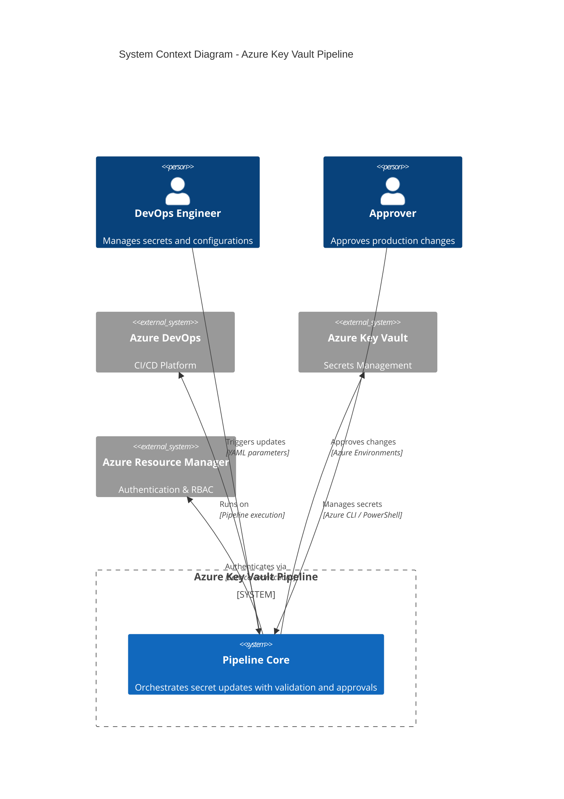
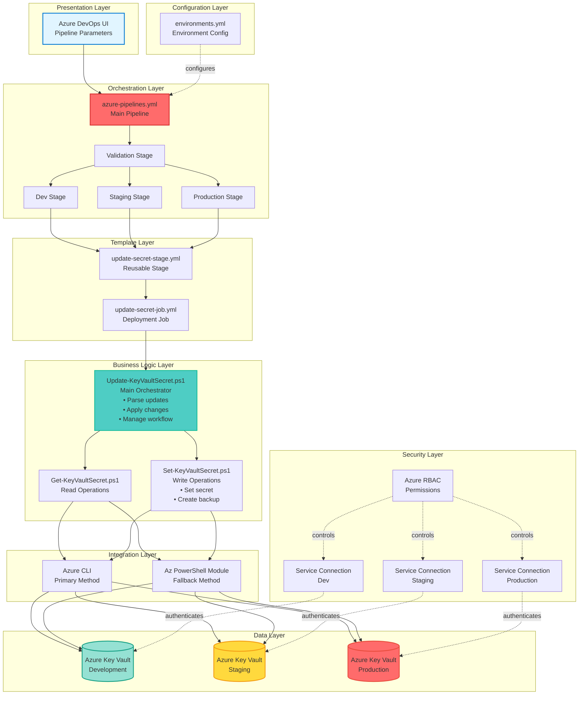
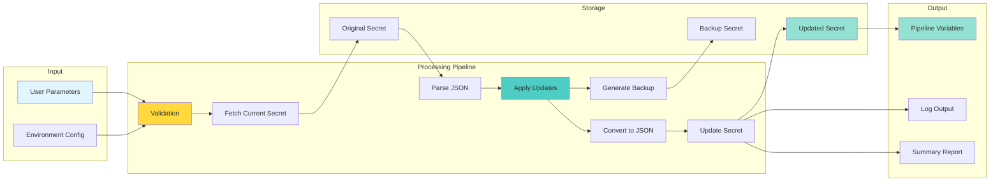
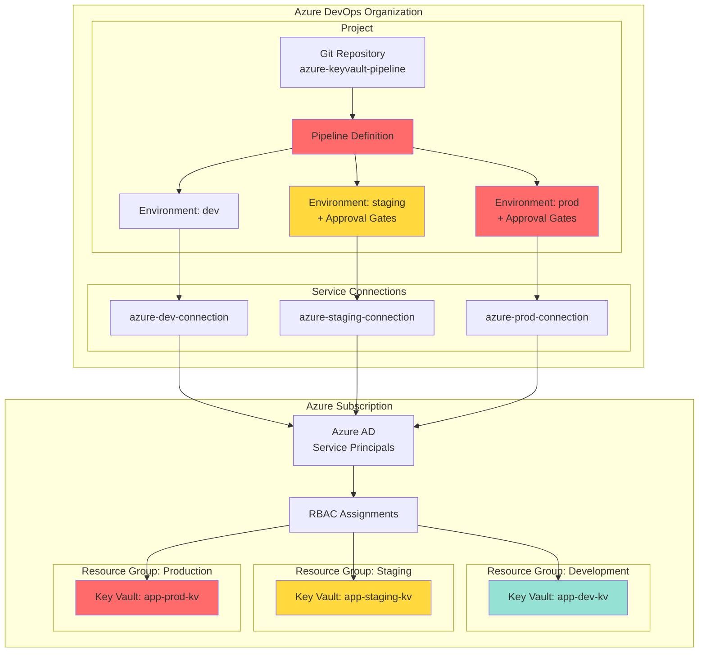
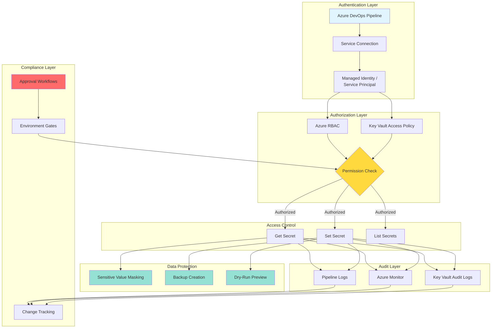
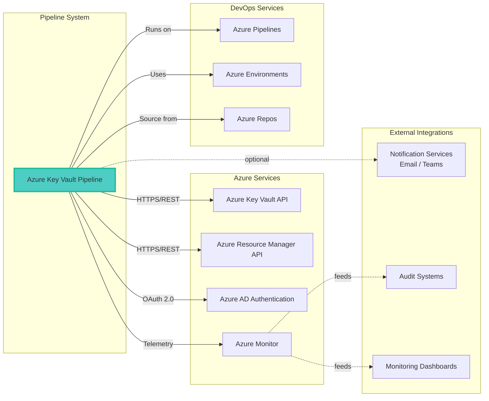
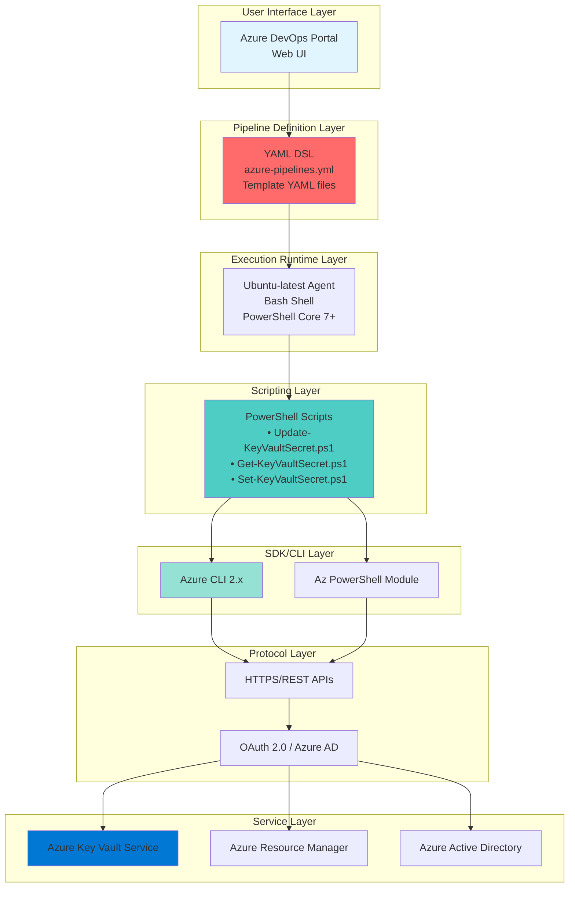

# Architecture Overview Diagram

## System Architecture

## Component Architecture

## Data Flow Architecture

## Deployment Architecture

## Security Architecture

## Integration Points

## Technology Stack Layers

