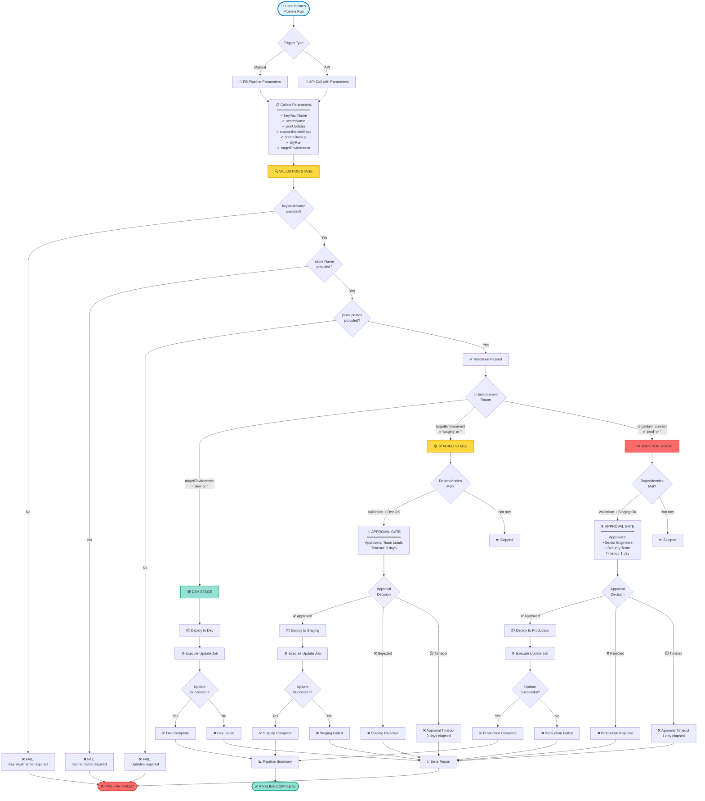

# Workflow Flowcharts

## 1. Complete End-to-End Pipeline Flow



## 2. Secret Update Process (Detailed)

```mermaid
flowchart TD
    Start([▶️ Start Update Script]) --> Init[🔧 Initialize<br/>━━━━━━━━━━━━━━━<br/>• Parse parameters<br/>• Set ErrorActionPreference<br/>• Initialize logging]

    Init --> LogHeader[📝 Log Header Info<br/>━━━━━━━━━━━━━━━<br/>Environment: {env}<br/>Key Vault: {vault}<br/>Secret: {name}<br/>Flags: nested/backup/dryrun]

    LogHeader --> ParseUpdates[🔍 Parse jsonUpdates<br/>━━━━━━━━━━━━━━━<br/>Input: key1=val1,key2=val2<br/>Output: Hashtable]

    ParseUpdates --> ParseCheck{Parse<br/>Success?}
    ParseCheck -->|No| ParseError[❌ ERROR:<br/>Invalid update format]
    ParseCheck -->|Yes| CountUpdates[📊 Count: {n} updates]

    CountUpdates --> FetchSecret[📥 Fetch Existing Secret<br/>━━━━━━━━━━━━━━━<br/>Call: Get-KeyVaultSecret.ps1]

    FetchSecret --> FetchMethod{Method}
    FetchMethod -->|Primary| AzCLI1[🔹 Try Azure CLI<br/>az keyvault secret show]
    FetchMethod -->|Fallback| AzPS1[🔸 Try Az PowerShell<br/>Get-AzKeyVaultSecret]

    AzCLI1 --> FetchResult{Fetch<br/>Success?}
    AzPS1 --> FetchResult

    FetchResult -->|No - Not Found| CreateNew[💡 Secret doesn't exist<br/>Will create new]
    FetchResult -->|No - Error| FetchError[❌ ERROR:<br/>Cannot access Key Vault]
    FetchResult -->|Yes| ParseJSON[🔄 Parse JSON Content<br/>ConvertFrom-Json]

    CreateNew --> EmptyJSON[📄 Start with empty JSON: {}]
    EmptyJSON --> ConvertHash

    ParseJSON --> JSONCheck{Valid<br/>JSON?}
    JSONCheck -->|No| JSONError[❌ ERROR:<br/>Invalid JSON in secret]
    JSONCheck -->|Yes| ConvertHash[🔄 Convert to Hashtable<br/>ConvertTo-Hashtable]

    ConvertHash --> BackupCheck{createBackup<br/>= true?}

    BackupCheck -->|Yes| DryRunBackup{dryRun<br/>= true?}
    BackupCheck -->|No| ApplyLoop

    DryRunBackup -->|Yes| SkipBackup[⏭️ Skip backup<br/>dry-run mode]
    DryRunBackup -->|No| CreateBackup[💾 Create Backup<br/>━━━━━━━━━━━━━━━<br/>Name: {secret}-backup-{timestamp}<br/>Call: Backup-KeyVaultSecret]

    SkipBackup --> ApplyLoop
    CreateBackup --> BackupResult{Backup<br/>Success?}
    BackupResult -->|No| BackupError[❌ ERROR:<br/>Backup creation failed]
    BackupResult -->|Yes| BackupSuccess[✅ Backup created:<br/>{backup-name}]

    BackupSuccess --> ApplyLoop[🔁 FOR EACH update in list]

    ApplyLoop --> GetKV[Get key-value pair<br/>key = {k}, value = {v}]

    GetKV --> NestedCheck{supportNestedKeys<br/>= true<br/>AND<br/>key contains '.'?}

    NestedCheck -->|Yes| SplitPath[Split key by dots<br/>Example: a.b.c → [a, b, c]]
    NestedCheck -->|No| DirectAssign[Direct Assignment<br/>hashtable[key] = value]

    SplitPath --> Navigate[🧭 Navigate Hierarchy<br/>━━━━━━━━━━━━━━━<br/>For each part:<br/>• Check if exists<br/>• Create if missing<br/>• Move to next level]

    Navigate --> SetLeaf[Set Leaf Value<br/>Set-NestedValue]

    SetLeaf --> TrackChange
    DirectAssign --> TrackChange[📝 Track Change<br/>━━━━━━━━━━━━━━━<br/>Old: {oldValue}<br/>New: {newValue}]

    TrackChange --> MaskValue[🔒 Mask Sensitive Values<br/>Display: XX****XX]

    MaskValue --> MoreUpdates{More<br/>updates?}
    MoreUpdates -->|Yes| ApplyLoop
    MoreUpdates -->|No| DisplayChanges[📋 Display All Changes<br/>━━━━━━━━━━━━━━━<br/>key1: old → new<br/>key2: old → new]

    DisplayChanges --> CheckDryRun{dryRun<br/>= true?}

    CheckDryRun -->|Yes| PreviewJSON[👁️ PREVIEW MODE<br/>━━━━━━━━━━━━━━━<br/>Show updated JSON<br/>No changes saved]
    CheckDryRun -->|No| ConvertToJSON[🔄 Convert Hashtable<br/>to JSON String<br/>ConvertTo-Json -Depth 10]

    PreviewJSON --> DryRunEnd[✅ Dry-run complete<br/>Exit 0]

    ConvertToJSON --> SetSecret[📤 Update Key Vault Secret<br/>━━━━━━━━━━━━━━━<br/>Call: Set-KeyVaultSecret.ps1]

    SetSecret --> SetMethod{Method}
    SetMethod -->|Primary| AzCLI2[🔹 Try Azure CLI<br/>az keyvault secret set]
    SetMethod -->|Fallback| AzPS2[🔸 Try Az PowerShell<br/>Set-AzKeyVaultSecret]

    AzCLI2 --> SetResult{Set<br/>Success?}
    AzPS2 --> SetResult

    SetResult -->|No| SetError[❌ ERROR:<br/>Failed to update secret]
    SetResult -->|Yes| SetVars[📊 Set Pipeline Variables<br/>━━━━━━━━━━━━━━━<br/>SecretUpdateStatus = Success<br/>UpdatedKeysCount = {count}]

    SetVars --> LogSuccess[✅ SUCCESS<br/>━━━━━━━━━━━━━━━<br/>Secret: {name}<br/>Updated keys: {count}<br/>Backup: {backup-name}]

    LogSuccess --> SuccessEnd([✅ Exit 0])

    %% Error handlers
    ParseError --> ErrorEnd
    FetchError --> ErrorEnd
    JSONError --> ErrorEnd
    BackupError --> ErrorEnd
    SetError --> ErrorEnd
    ErrorEnd([❌ Exit 1])

    DryRunEnd --> End([🏁 Complete])
    SuccessEnd --> End

    style Start fill:#e1f5ff,stroke:#0078d4,stroke-width:3px
    style CreateBackup fill:#ffd93d,stroke:#f39c12,stroke-width:2px
    style CheckDryRun fill:#ffd93d,stroke:#f39c12,stroke-width:2px
    style PreviewJSON fill:#4ecdc4,stroke:#1abc9c,stroke-width:2px
    style LogSuccess fill:#95e1d3,stroke:#16a085,stroke-width:2px
    style End fill:#95e1d3,stroke:#16a085,stroke-width:3px
    style ErrorEnd fill:#ff6b6b,stroke:#e74c3c,stroke-width:3px
```

## 3. Nested JSON Update Algorithm

```mermaid
flowchart TD
    Start([Input: key.path.to.value=newValue]) --> Parse[Parse Input<br/>━━━━━━━━━━━━━━━<br/>key = "key.path.to.value"<br/>value = "newValue"]

    Parse --> Split[Split key by '.'<br/>━━━━━━━━━━━━━━━<br/>parts = [key, path, to, value]]

    Split --> InitCurrent[current = rootHashtable<br/>depth = 0]

    InitCurrent --> Loop[🔁 FOR EACH part in parts<br/>except last]

    Loop --> GetPart[part = parts[depth]<br/>nextPart = parts[depth + 1]]

    GetPart --> Exists{current[part]<br/>exists?}

    Exists -->|No| CreateNode[Create new hashtable<br/>current[part] = @{}]
    Exists -->|Yes| CheckType{Is<br/>hashtable?}

    CheckType -->|No| TypeError[❌ ERROR:<br/>Cannot navigate<br/>existing value is not object]
    CheckType -->|Yes| NavNext[Navigate to next level<br/>current = current[part]]

    CreateNode --> NavNext

    NavNext --> IncDepth[depth++]

    IncDepth --> MoreParts{More parts<br/>to process?}

    MoreParts -->|Yes| Loop
    MoreParts -->|No| SetValue[Set final value<br/>━━━━━━━━━━━━━━━<br/>lastPart = parts[depth]<br/>current[lastPart] = value]

    SetValue --> Success[✅ Value set successfully]

    Success --> End([Return updated hashtable])
    TypeError --> ErrorEnd([❌ Return error])

    style Start fill:#e1f5ff,stroke:#0078d4,stroke-width:2px
    style Loop fill:#ffd93d,stroke:#f39c12,stroke-width:2px
    style SetValue fill:#95e1d3,stroke:#16a085,stroke-width:2px
    style Success fill:#95e1d3,stroke:#16a085,stroke-width:2px
    style End fill:#4ecdc4,stroke:#1abc9c,stroke-width:3px
    style ErrorEnd fill:#ff6b6b,stroke:#e74c3c,stroke-width:3px
```

**Example Execution:**

```mermaid
graph TD
    A[Input: database.connection.host = 'newdb.com'] --> B[Root = {}]
    B --> C[Parts = [database, connection, host]]

    C --> D[Iteration 1:<br/>part = 'database']
    D --> E{Root['database']<br/>exists?}
    E -->|No| F[Create: Root['database'] = {}]
    F --> G[current = Root['database']]

    G --> H[Iteration 2:<br/>part = 'connection']
    H --> I{current['connection']<br/>exists?}
    I -->|No| J[Create: current['connection'] = {}]
    J --> K[current = current['connection']]

    K --> L[Final part: 'host']
    L --> M[Set: current['host'] = 'newdb.com']

    M --> N[Result:<br/>{<br/>  database: {<br/>    connection: {<br/>      host: 'newdb.com'<br/>    }<br/>  }<br/>}]

    style A fill:#e1f5ff
    style M fill:#95e1d3
    style N fill:#4ecdc4
```

## 4. Backup and Rollback Process

```mermaid
flowchart TD
    Start([🔄 Backup Process]) --> Check{createBackup<br/>= true?}

    Check -->|No| Skip[⏭️ Skip backup<br/>Proceed to update]
    Check -->|Yes| DryCheck{dryRun<br/>= true?}

    DryCheck -->|Yes| SkipDry[⏭️ Skip backup<br/>in dry-run mode]
    DryCheck -->|No| GenName[🔖 Generate Backup Name<br/>━━━━━━━━━━━━━━━<br/>Format:<br/>{secretName}-backup-{timestamp}<br/>Example:<br/>app-config-backup-20260121-143530]

    GenName --> FetchCurrent[📥 Fetch Current Secret<br/>Get current value<br/>from Key Vault]

    FetchCurrent --> FetchOK{Fetch<br/>Success?}
    FetchOK -->|No| FetchErr[❌ Cannot create backup<br/>Original secret not found]
    FetchOK -->|Yes| CreateBackup[💾 Create Backup Secret<br/>━━━━━━━━━━━━━━━<br/>Name: {backup-name}<br/>Value: {original-content}<br/>Tags: {original-secret, timestamp}]

    CreateBackup --> BackupMethod{Method}
    BackupMethod -->|Primary| BackupCLI[🔹 Azure CLI<br/>az keyvault secret set]
    BackupMethod -->|Fallback| BackupPS[🔸 Az PowerShell<br/>Set-AzKeyVaultSecret]

    BackupCLI --> BackupResult{Created?}
    BackupPS --> BackupResult

    BackupResult -->|No| BackupErr[❌ ERROR:<br/>Backup creation failed<br/>Abort update]
    BackupResult -->|Yes| BackupSuccess[✅ Backup Created<br/>Name: {backup-name}]

    BackupSuccess --> LogBackup[📝 Log backup info<br/>Store in pipeline variables]

    LogBackup --> ProceedUpdate[▶️ Proceed with Update]

    Skip --> ProceedUpdate
    SkipDry --> ProceedUpdate
    ProceedUpdate --> End([Continue to Update])

    BackupErr --> ErrorEnd([❌ Abort Process])
    FetchErr --> ErrorEnd

    style Start fill:#e1f5ff,stroke:#0078d4,stroke-width:2px
    style CreateBackup fill:#ffd93d,stroke:#f39c12,stroke-width:2px
    style BackupSuccess fill:#95e1d3,stroke:#16a085,stroke-width:2px
    style End fill:#4ecdc4,stroke:#1abc9c,stroke-width:3px
    style ErrorEnd fill:#ff6b6b,stroke:#e74c3c,stroke-width:3px
```

**Rollback Process:**

```mermaid
flowchart TD
    StartRB([🔙 Rollback Initiated]) --> Reason{Rollback<br/>Reason}

    Reason -->|Issue Found| Issue[⚠️ Issue detected<br/>in updated secret]
    Reason -->|Failed Validation| Validate[❌ Validation failed<br/>after update]
    Reason -->|User Request| UserReq[👤 Manual rollback<br/>requested]

    Issue --> FindBackup
    Validate --> FindBackup
    UserReq --> FindBackup[🔍 Find Backup Secret<br/>━━━━━━━━━━━━━━━<br/>List secrets in Key Vault<br/>Pattern: {secret}-backup-*<br/>Sort by timestamp]

    FindBackup --> BackupFound{Backup<br/>Found?}

    BackupFound -->|No| NoBackup[❌ No backup available<br/>Manual intervention required]
    BackupFound -->|Yes| ListBackups[📋 List Available Backups<br/>━━━━━━━━━━━━━━━<br/>1. app-config-backup-20260121-143530<br/>2. app-config-backup-20260120-102015<br/>3. app-config-backup-20260119-091245]

    ListBackups --> SelectBackup[👆 Select Backup Version<br/>Usually most recent]

    SelectBackup --> FetchBackup[📥 Fetch Backup Content<br/>Get backup secret value]

    FetchBackup --> FetchOK{Fetch<br/>Success?}
    FetchOK -->|No| FetchError[❌ Cannot retrieve backup]
    FetchOK -->|Yes| RestoreConfirm{Confirm<br/>Restore?}

    RestoreConfirm -->|No| CancelRB[❌ Rollback cancelled]
    RestoreConfirm -->|Yes| PreRollbackBackup[💾 Create Backup<br/>of Current State<br/>before rollback]

    PreRollbackBackup --> Restore[🔄 Restore Original Secret<br/>━━━━━━━━━━━━━━━<br/>Name: {original-secret-name}<br/>Value: {backup-content}]

    Restore --> RestoreMethod{Method}
    RestoreMethod -->|Primary| RestoreCLI[🔹 Azure CLI]
    RestoreMethod -->|Fallback| RestorePS[🔸 Az PowerShell]

    RestoreCLI --> RestoreResult{Restore<br/>Success?}
    RestorePS --> RestoreResult

    RestoreResult -->|No| RestoreError[❌ Rollback failed]
    RestoreResult -->|Yes| Verify[✅ Verify Restoration<br/>Compare with backup]

    Verify --> VerifyOK{Verification<br/>Passed?}
    VerifyOK -->|No| VerifyFail[⚠️ Verification warning<br/>Manual check recommended]
    VerifyOK -->|Yes| RollbackSuccess[✅ ROLLBACK SUCCESSFUL<br/>━━━━━━━━━━━━━━━<br/>Secret restored to:<br/>{backup-timestamp}]

    RollbackSuccess --> Cleanup{Cleanup<br/>failed backup?}
    Cleanup -->|Yes| DeleteFailed[🗑️ Delete failed update backup]
    Cleanup -->|No| KeepAll[📦 Keep all backups]

    DeleteFailed --> Complete
    KeepAll --> Complete[🏁 Rollback Complete]

    NoBackup --> ManualEnd([⚠️ Manual Intervention])
    FetchError --> ManualEnd
    CancelRB --> CancelEnd([❌ Cancelled])
    RestoreError --> ErrorEnd([❌ Failed])
    VerifyFail --> WarningEnd([⚠️ Needs Verification])
    Complete --> SuccessEnd([✅ Complete])

    style StartRB fill:#e1f5ff,stroke:#0078d4,stroke-width:3px
    style FindBackup fill:#ffd93d,stroke:#f39c12,stroke-width:2px
    style Restore fill:#ffd93d,stroke:#f39c12,stroke-width:2px
    style RollbackSuccess fill:#95e1d3,stroke:#16a085,stroke-width:2px
    style SuccessEnd fill:#95e1d3,stroke:#16a085,stroke-width:3px
    style ErrorEnd fill:#ff6b6b,stroke:#e74c3c,stroke-width:3px
```

## 5. Error Handling and Fallback Strategy

```mermaid
flowchart TD
    Start([⚙️ Azure Operation Needed]) --> TryCLI[🔹 TRY: Azure CLI<br/>━━━━━━━━━━━━━━━<br/>az keyvault secret {operation}]

    TryCLI --> CLIResult{CLI<br/>Success?}

    CLIResult -->|✅ Success| CLISuccess[Return result]
    CLIResult -->|❌ Failure| CheckError{Error<br/>Type?}

    CheckError -->|Command not found| InstallCLI[📦 ERROR: Azure CLI not installed<br/>━━━━━━━━━━━━━━━<br/>Recommendation:<br/>Install Azure CLI 2.x]

    CheckError -->|Authentication failed| AuthError[🔐 ERROR: Authentication failed<br/>━━━━━━━━━━━━━━━<br/>Possible causes:<br/>• Service connection invalid<br/>• Token expired<br/>• Insufficient permissions]

    CheckError -->|Secret not found| SecretNotFound[📭 Secret does not exist<br/>Return null<br/>Can proceed to create]

    CheckError -->|Network error| NetworkError[🌐 Network/Timeout error<br/>Retry logic activated]

    CheckError -->|Other error| OtherError[⚠️ Other CLI error<br/>Attempt fallback]

    InstallCLI --> TryFallback
    OtherError --> TryFallback
    NetworkError --> RetryLogic{Retry<br/>attempts<br/>< 3?}

    RetryLogic -->|Yes| WaitRetry[⏱️ Wait exponential backoff<br/>Retry CLI command]
    RetryLogic -->|No| TryFallback

    WaitRetry --> TryCLI

    TryFallback[🔸 TRY: Az PowerShell Module<br/>━━━━━━━━━━━━━━━] --> CheckModule{Module<br/>Available?}

    CheckModule -->|No| InstallModule[📦 ERROR: Az.KeyVault not installed<br/>━━━━━━━━━━━━━━━<br/>Recommendation:<br/>Install-Module Az.KeyVault]
    CheckModule -->|Yes| TryPS[Execute via PowerShell:<br/>Get/Set-AzKeyVaultSecret]

    TryPS --> PSResult{PS<br/>Success?}

    PSResult -->|✅ Success| PSSuccess[Return result]
    PSResult -->|❌ Failure| PSError{Error<br/>Type?}

    PSError -->|Authentication| PSAuthError[🔐 ERROR: PowerShell auth failed]
    PSError -->|Not found| PSNotFound[📭 Secret not found<br/>Return null]
    PSError -->|Other| PSFatal[❌ FATAL: All methods failed]

    PSAuthError --> FinalError
    PSFatal --> FinalError[❌ CRITICAL ERROR<br/>━━━━━━━━━━━━━━━<br/>Both Azure CLI and<br/>PowerShell module failed<br/>━━━━━━━━━━━━━━━<br/>Action Required:<br/>1. Check service connection<br/>2. Verify RBAC permissions<br/>3. Validate Key Vault name<br/>4. Review network connectivity]

    InstallModule --> FinalError

    CLISuccess --> End([✅ Operation Complete])
    PSSuccess --> End
    SecretNotFound --> End
    PSNotFound --> End

    AuthError --> AuthGuide[📖 Auth Troubleshooting:<br/>━━━━━━━━━━━━━━━<br/>1. Verify service connection<br/>2. Check RBAC role assignments<br/>3. Validate Key Vault access policy<br/>4. Ensure identity has permissions]

    AuthGuide --> ManualEnd([⚠️ Manual Fix Required])
    FinalError --> ErrorEnd([❌ Abort Operation])

    style Start fill:#e1f5ff,stroke:#0078d4,stroke-width:2px
    style TryCLI fill:#4ecdc4,stroke:#1abc9c,stroke-width:2px
    style TryFallback fill:#ffd93d,stroke:#f39c12,stroke-width:2px
    style TryPS fill:#ffd93d,stroke:#f39c12,stroke-width:2px
    style End fill:#95e1d3,stroke:#16a085,stroke-width:3px
    style ErrorEnd fill:#ff6b6b,stroke:#e74c3c,stroke-width:3px
    style ManualEnd fill:#ffd93d,stroke:#f39c12,stroke-width:3px
```
